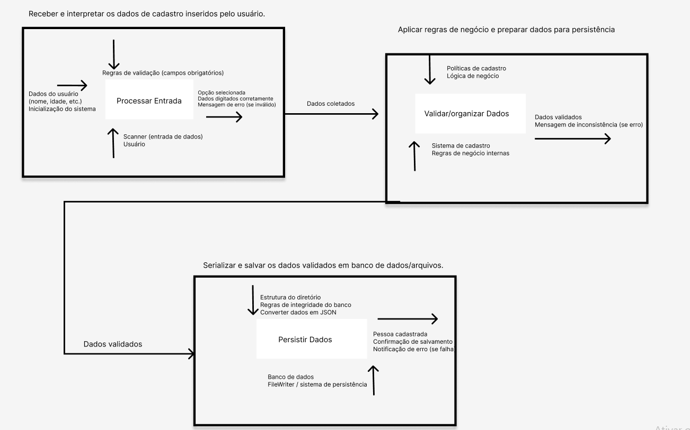
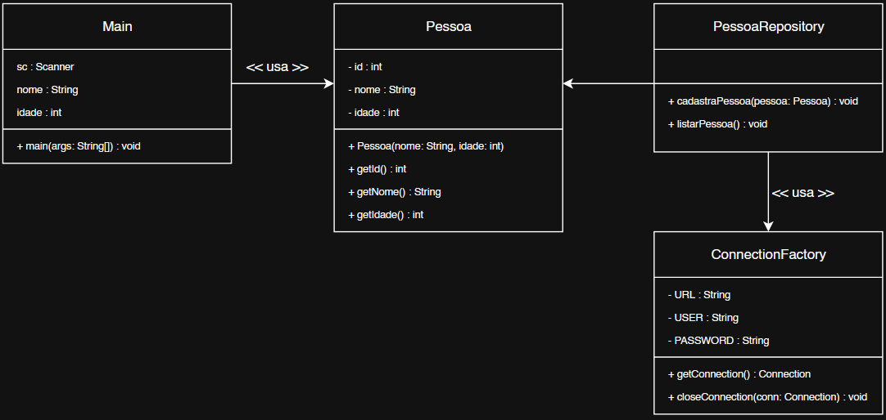
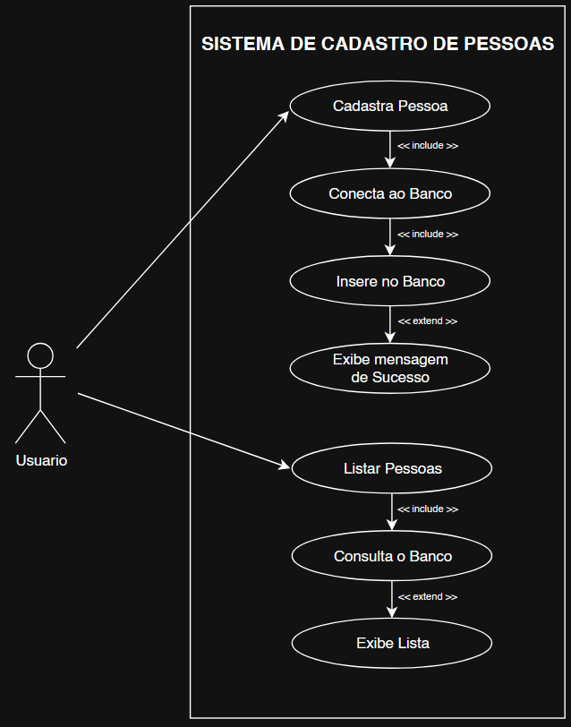

# grupo.tads.testes
Curso: Analise e Desenvolvimento de Sistemas - Turma: 4NC
* Intergrantes:
* Felipe Nogueira Silva
* Ranielly Evellyn Cunha
* Stefany Caroline Ferreira Sampaio
  
Este projeto tem como objetivo exemplificar o cadastro de pessoas em um sistema, utilizando a persistência em arquivos .json, e gerando um arquivo para cada cadastro

# Diagrama IDEF0

# Diagrama de classe em UML

# Casos de uso em UML 

# Casos de testes 

Nome simples
Entrada: Nome = "Ana", Idade = 25
Resultado esperado: Cadastro realizado com sucesso.

Nome com espaços
Entrada: Nome = "Maria Silva", Idade = 30
Resultado esperado: Cadastro realizado com sucesso.

Nome com caracteres acentuados
Entrada: Nome = "José Álvares", Idade = 40
Resultado esperado: Cadastro realizado com sucesso.

Nome vazio
Entrada: Nome = "", Idade = 20
Resultado esperado: Erro "Nome não pode ser vazio".

Idade negativa
Entrada: Nome = "Carlos", Idade = -5
Resultado esperado: Erro "Idade inválida".
