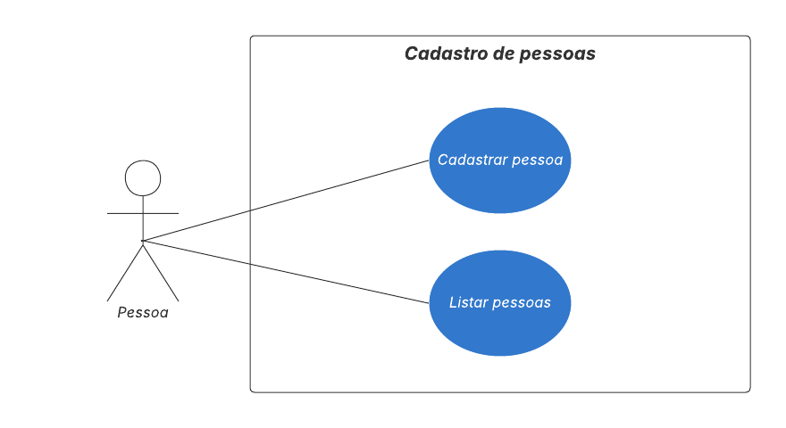

# grupo.tads.testes
Curso: Analise e Desenvolvimento de Sistemas - Turma: 4NC
* Intergrantes:
* Felipe Nogueira Silva
* Ranielly Evellyn Cunha
* Stefany Caroline Ferreira Sampaio
  
Este projeto tem como objetivo exemplificar o cadastro de pessoas em um sistema, utilizando a persistência em arquivos .json, e gerando um arquivo para cada cadastro

# Diagrama IDEF0

# Diagrama de classe em UML

# Casos de uso em UML 
